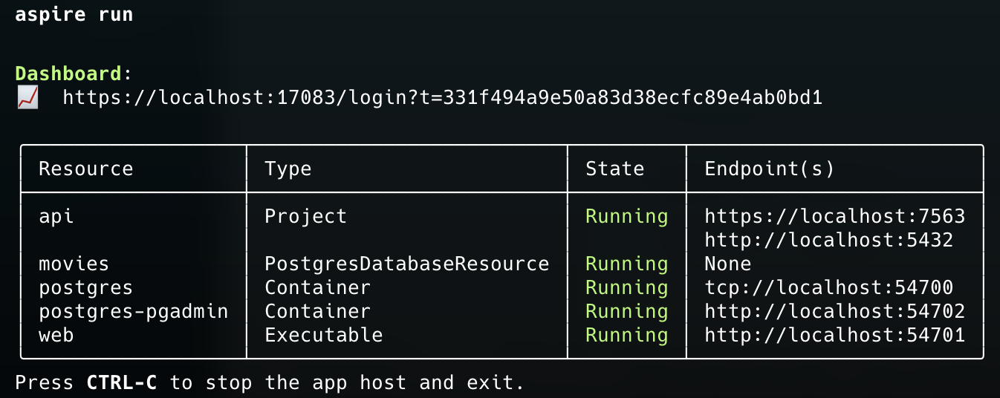
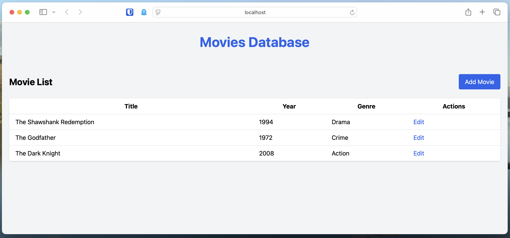
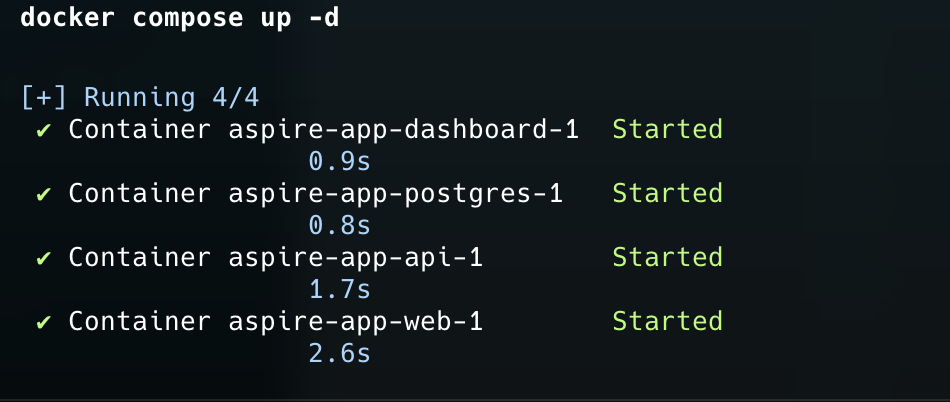
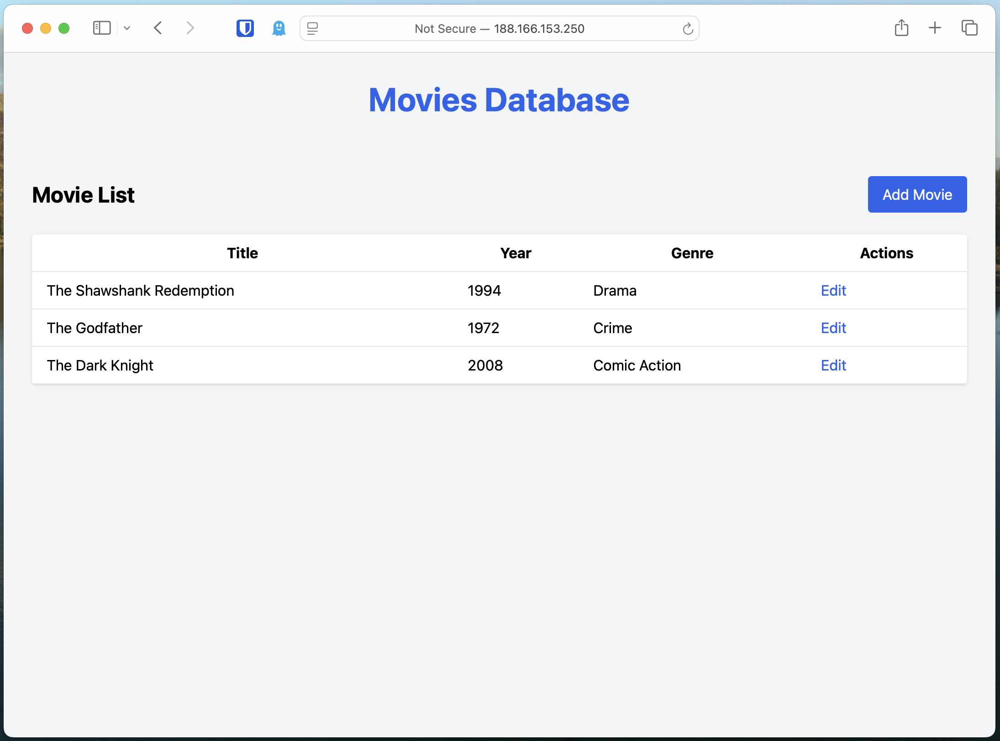
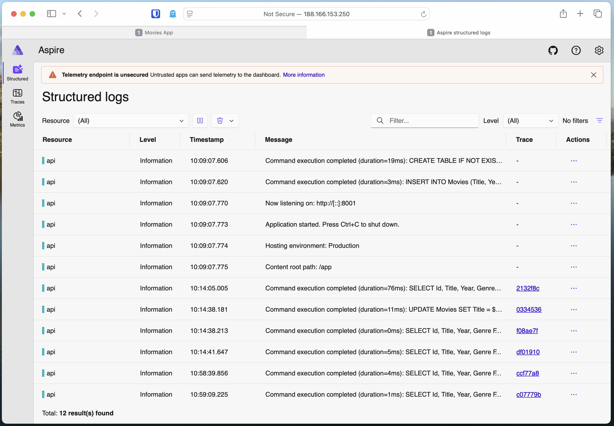

# Aspire JavaScript Docker Example

This repo is to acompany my blog post on [Using Aspire with Docker Hosts](https://intrepid-developer.com/blog/aspire-with-docker).

This project demonstrates how to use [Aspire](https://github.com/dotnet/aspire) to orchestrate and deploy a multi-service application using Docker. The stack includes:
- A .NET API backend
- A PostgreSQL database
- A Vue.js frontend built with Vite

**No Azure resources are required**, this setup works with any Docker compatible host, such as Digital Ocean, AWS EC2, or your own server. You can get $200 free credit with Digital Ocean using my [Referral Link](https://m.do.co/c/1791153d5ad6).

## Overview

In this guide, you'll learn how to:
- Use Aspire to manage a .NET API, PostgreSQL, and a JavaScript frontend.
- Publish your Aspire project to Docker Compose.
- Deploy your application to a Digital Ocean droplet (or any Docker host).

## Why Aspire for JavaScript and More?

Aspire provides a powerful way to define, compose, and manage cloud-native applications. Although it's built with .NET in mind, Aspire's flexible architecture allows you to include and orchestrate non-.NET services, such as Node.js or other JavaScript-based apps, alongside .NET services and databases like PostgreSQL.

## Prerequisites

- [Docker](https://www.docker.com/get-started) installed locally.
- [Aspire CLI](https://learn.microsoft.com/en-us/dotnet/aspire/whats-new/dotnet-aspire-9.2#-aspire-cli-preview) installed.
- A [Digital Ocean](https://m.do.co/c/1791153d5ad6) account and a provisioned droplet (or any Docker-compatible host).
- Basic familiarity with .NET, JavaScript, and Docker.


## Running Locally with Aspire

1. **Clone this repository:**
   ```sh
   git clone https://github.com/intrepid-developer/aspire-javascript-docker.git
   cd aspire-javascript-docker
   ```

2. **Publish Aspire project to Docker Compose:**
   ```sh
   aspire run
   ```

3. **Access your Vue.js frontend** at [http://localhost:PORT](http://localhost:PORT) (replace `PORT` with the port your frontend is configured to use).


## Running Locally with Docker Compose

1. **Clone this repository:**
   ```sh
   git clone https://github.com/intrepid-developer/aspire-javascript-docker.git
   cd aspire-javascript-docker
   ```

2. **Publish Aspire project to Docker Compose:**
   ```sh
   aspire publish -o /infra
   ```

3. **Start the application:**
   ```sh
   cd infra
   docker compose up
   ```

4. **Access your Vue.js frontend** at [http://localhost:PORT](http://localhost:PORT) (replace `PORT` with the port your frontend is configured to use).

## Deploying to Digital Ocean (or Any Docker Host)

1. **Build and push Docker images** to your container registry (e.g., Docker Hub or Digital Ocean Container Registry).

2. **Copy your `docker-compose.yml` and `.env`** to your target host.

3. **SSH into your host:**
   ```sh
   ssh root@your_droplet_ip
   ```

4. **Pull images and start services:**
   ```sh
   docker compose pull
   docker compose up -d
   ```

5. **Verify your app is running** by visiting your droplets host's public IP in a browser `http://your_droplet_ip:8006`


## Bonus: Cutdown Aspire Dashboard
This example also includes a cutdown version of the Aspire dashboard, which provides a simple web interface to view and manage your Aspire applications.
This gets published in the docker-compose.yml file and can be accessed at [http://localhost:8006](http://localhost:8006) when running locally, or at `http://your_droplet_ip:8007` when deployed to a Docker host.

You will need to get the Dashboard token from. To do that you can run this command on the droplet:
```sh
docker logs -f aspire-app-dashboard-1
```

And then look for:
```sh
Login to the dashboard at http://localhost:18888/login?t=f3867cc7bf09f0c048dade2703f6bc95. The URL may need changes depending on how network access to the container is configured.
```

You'll have to update the URL with your droplets ip address and the default port should be `8007` instead of `18888`.

## Key Takeaways

- Aspire can orchestrate and deploy multi-language, multi-service applications, not just .NET.
- No Azure resources are required—works with any Docker-compatible host.
- Docker Compose makes it easy to run your Aspire-managed apps locally and in the cloud.

## Resources

- [Aspire Documentation](https://learn.microsoft.com/dotnet/aspire/)
- [Docker Compose Docs](https://docs.docker.com/compose/)
- [Digital Ocean Droplets](https://www.digitalocean.com/products/droplets/)

---
Happy coding!
